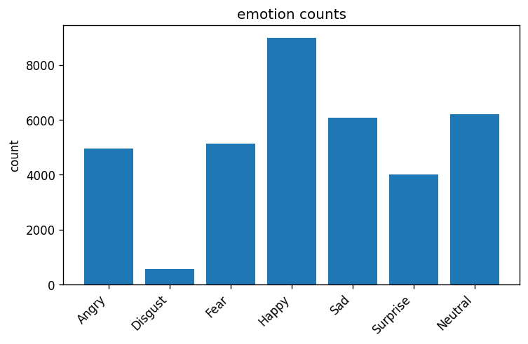
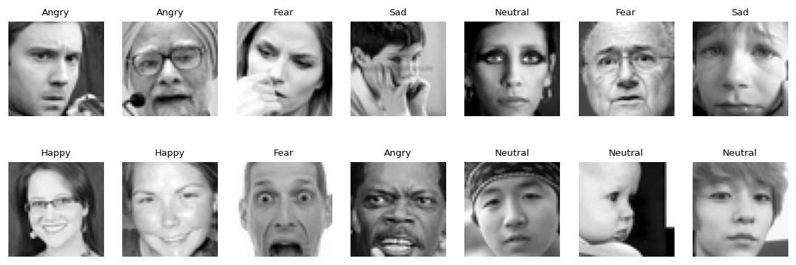

# FER2013 - სახის ემოციების ამოცნობა

[Kaggle-ის ლინკი](https://kaggle.com/competitions/challenges-in-representation-learning-facial-expression-recognition-challenge)

7 კლასი გვაქვს:

`0=Angry, 1=Disgust, 2=Fear, 3=Happy, 4=Sad, 5=Surprise, 6=Neutral`

- GitHub: https://github.com/Saba0033/ML_Asgn4
- Wandb: https://wandb.ai/sekhv23-free-university-of-tbilisi/ML_Asgn4

---

```
selection_score = val_acc - 0.5 * max(0, overfit_gap - 0.05)
```

`overfit_gap = train_acc - val_acc`. ანუ თუ gap-ი პატარაა (< 0.05) არაფერს ვაკლებ, თუ დიდია ვაჯარიმებ.

---

## სტრუქტურა

კოდი თითქმის სულ `src/`-შია დაწერილი, notebook-ებში მარტო config და გაშვებაა. ასე უფრო სუფთაა და ერთი და ქოდის რეფეთიშენი არ ხდება.

```
eda.ipynb           
baseline_mlp.ipynb 
tiny_cnn.ipynb      
deep_cnn.ipynb       
resnet.ipynb       
model_inference.ipynb 
src/                
```

ყველა მოდელი ცალკე notebook-ია და Wandb-ზე ცალკე **group**-ად ჩანს.

---

## EDA (მონაცემების დათვალიერება)

`eda.ipynb`-ში ვნახე რამდენი სურათია თითო კლასზე. მთავარი რაც შევნიშნე - მონაცემები **არ არის დაბალანსებული**. Happy ბევრია, Disgust კი ძალიან ცოტა. ეს მერე პრობლემას ქმნის, იმიტო რომ მოდელი ცდილობს ხშირ კლასებზე გამოიცნოს.

ამიტომ მერე CNN-ებში **class weights** გამოვიყენე, ანუ იშვიათ კლასებს მეტი წონა მივეცი loss-ში.





---

## მოდელები 

თანდათან ვზრდიდი სირთულეს, რომ დამენახა ყოველ ნაბიჯზე რამდენით უმჯობესდება:

1. **MLP** - უბრალოდ სურათი გავაბრტყელე ერთ გრძელ ვექტორად და fully-connected ფენები. baseline-ია, CNN-ი არ აქვს ანუ სურათის სტრუქტურას ვერ იგებს.
2. **TinyCNN** - 2 conv ბლოკი. პატარაა მარა უკვე conv აქვს, ანუ ლოკალურ pattern-ებს ხედავს.
3. **DeepCNN** - უფრო ღრმა, BatchNorm, dropout, **augmentation** და class weights.
4. **ResNet18** - გამზადებული არქიტექტურა, scratch-იდან და pretrained-იც ვცადე.

---

## შედეგები

ყველა მონაცემი Wandb-დანაა. `gap = train_acc - val_acc` (რაც დიდია მით უფრო overfit)

### MLP

| config | hidden | dropout | lr | val_acc | gap | რეჟიმი |
|---|---|---|---|---|---|---|
| underfit | 64 | 0.5 | 1e-3 | 0.3996 | -0.022 | underfit |
| wellfit_a | 512 | 0.3 | 1e-3 | 0.4642 | 0.077 | well-fit |
| **wellfit_b** | 512 | 0.5 | 5e-4 | **0.4536** | 0.042 | well-fit (best) |
| overfit | 1024 | 0.0 | 1e-3 | 0.4667 | **0.436** | overfit |
| lr_high | 512 | 0.3 | 1e-2 | 0.2499 | -0.011 | აფეთქდა |

`overfit` კონფიგმა train-ზე ~0.90 აიღო მარა val-ზე მხოლოდ 0.47 - ეს არის **overfit**, gap-ი 0.44-ია. `lr_high`-ს lr ძალიან დიდი ჰქონდა და ვერაფერი ისწავლა (0.25, თითქმის random). საბოლოო MLP-მ val ~**0.47** აიღო. baseline-ისთვის ნორმალურია მარა ცხადია სუსტია.

### TinyCNN

| config | width | dropout | lr | val_acc | gap | რეჟიმი |
|---|---|---|---|---|---|---|
| underfit | 8 | 0.5 | 1e-3 | 0.5208 | 0.054 | underfit |
| wellfit_a | 32 | 0.3 | 1e-3 | 0.5483 | 0.253 | overfit-ისკენ |
| **wellfit_b** | 64 | 0.3 | 1e-3 | **0.5389** | 0.062 | well-fit (best) |
| overfit | 64 | 0.0 | 1e-3 | 0.5336 | 0.165 | overfit |
| lr_high | 32 | 0.3 | 1e-2 | 0.4327 | -0.015 | მაღალი lr |

მარტო conv-ის დამატებამ უკვე ბევრი მოამატა: MLP 0.47 → TinyCNN ~0.54. `wellfit_a`-ს val მაღალი ჰქონდა (0.5483) მარა gap-ი 0.25, ანუ overfit იყო, ამიტომ score-მა `wellfit_b` აარჩია (gap ბევრად პატარა).

### DeepCNN

| config | n_blocks | bn | dropout | val_acc | gap | რეჟიმი |
|---|---|---|---|---|---|---|
| underfit_1blk | 1 | არა | 0.5 | 0.4625 | -0.073 | underfit |
| 2blk_bn | 2 | კი | 0.3 | 0.4252 | -0.072 | underfit |
| 3blk_bn_drop | 3 | კი | 0.4 | 0.4021 | -0.073 | underfit |
| **overfit_noreg** | 3 | არა | 0.0 | **0.6021** | 0.010 | best |

აქ უფრო საინტერესო რეზალთია: regularization-ით სავსე კონფიგებმა (dropout + BN) ცუდად ისწავლეს ცოტა epoch-ში - ანუ underfit იყვნენ, ჯერ ვერ მოასწრეს სწავლა. `overfit_noreg` კი (regularization-ის გარეშე) ყველაზე კარგი გამოვიდა. საბოლოო წვრთნა მერე მეტ epoch-ზე და cosine scheduler-ით გავუშვი და val **~0.65** გამოვიდა.

**Augmentation-ის ablation** (იგივე მოდელი, ერთხელ aug-ით, ერთხელ უ-აგ):

| | train_acc | val_acc | gap |
|---|---|---|---|
| aug-ის გარეშე | ~0.96 | ~0.62 | ~0.34 (overfit) |
| aug-ით | ~0.64 | ~0.62 | ~0.02 (კარგი) |

ეaug-ის გარეშე train-ზე 0.96 ხდება მარა val 0.62-ზე ჩერდება (ანუ უბრალოდ იზეპირებს). aug-ით train და val თითქმის ერთნაირია, gap ქრება. accuracy იგივეა მარა მოდელი ბევრად **ჯანსაღია**.

### ResNet18

| config | pretrained | dropout | lr | val_acc | gap | რეჟიმი |
|---|---|---|---|---|---|---|
| scratch_underfit | არა | 0.5 | 1e-2 | 0.4904 | -0.043 | underfit |
| scratch_wellfit | არა | 0.2 | 1e-3 | 0.6152 | 0.008 | well-fit |
| pretrained_wellfit | კი | 0.2 | 5e-4 | 0.6634 | 0.045 | well-fit |
| **pretrained_overfit** | კი | 0.0 | 1e-3 | **0.6757** | 0.072 | best |

აქ კარგად ჩანს pretrained-ის ძალა: scratch (0-დან) ~0.61 აიღო, pretrained კი ~0.67. ImageNet-ზე ნასწავლი ფიჩერები FER2013-საც ეხმარება, თუნდაც სხვა მონაცემებია. საბოლოო ResNet-მა val **~0.696** აიღო, რაც ყველაზე მაღალი შედეგია.

---

## საბოლოო შედარება

| მოდელი | val_acc (final) | კომენტარი |
|---|---|---|
| MLP | ~0.47 | baseline, სუსტი |
| TinyCNN | ~0.52 | conv დაეხმარა |
| DeepCNN | ~0.65 | aug + class weights, კარგი |
| **ResNet18** | **~0.696** | **საუკეთესო** |

რაც უფრო ღრმა და ჭკვიანია მოდელი, მით უკეთესი შედეგი. **საუკეთესო მოდელად ResNet18 (pretrained) ავირჩიე**, იმიტო რომ val accuracy ყველაზე მაღალი ჰქონდა. ერთი რამ შევნიშნე - საბოლოო ResNet-ს გეფი ცოტა დიდი ჰქონდა (~0.23), ანუ ცოტა overfit-ია, მარა val accuracy მაინც ყველაზე მაღალია ამიტომ მაინც ის დავტოვე.

---

## Wandb

ყველაფერი  `ML_Asgn4` -შია. თითო არქიტექტურა ცალკე **group**-ია, თითო group-ში HP grid-ის run-ები + ერთი final run.

https://wandb.ai/sekhv23-free-university-of-tbilisi/ML_Asgn4

log-ში მიდის: train/val accuracy და loss ყოველ epoch-ზე, საბოლოო summary (best_val_acc, overfit_gap, selection_score), confusion matrix და training curves.

---

## Kaggle

`model_inference.ipynb` იღებს საუკეთესო მოდელს (`models/ResNet_best.pt`), პრედიქშენს აკეთებს `test.csv`-ზე და წერს `submissions/submission.csv`-ს (7178 სტრიქონი, თითო ტესტ-სურათზე ერთი კლასი).

ოღონდ საბმითი ვერ შევძელი, მემგონი ძველი რომ არის გამორთულია საბმიშენები.

---

## ბონუსი

Wandb report: https://wandb.ai/sekhv23-free-university-of-tbilisi/ML_Asgn4/reports/ML_Asgn4---FER2013--VmlldzoxNzI0NzE1Ng==
